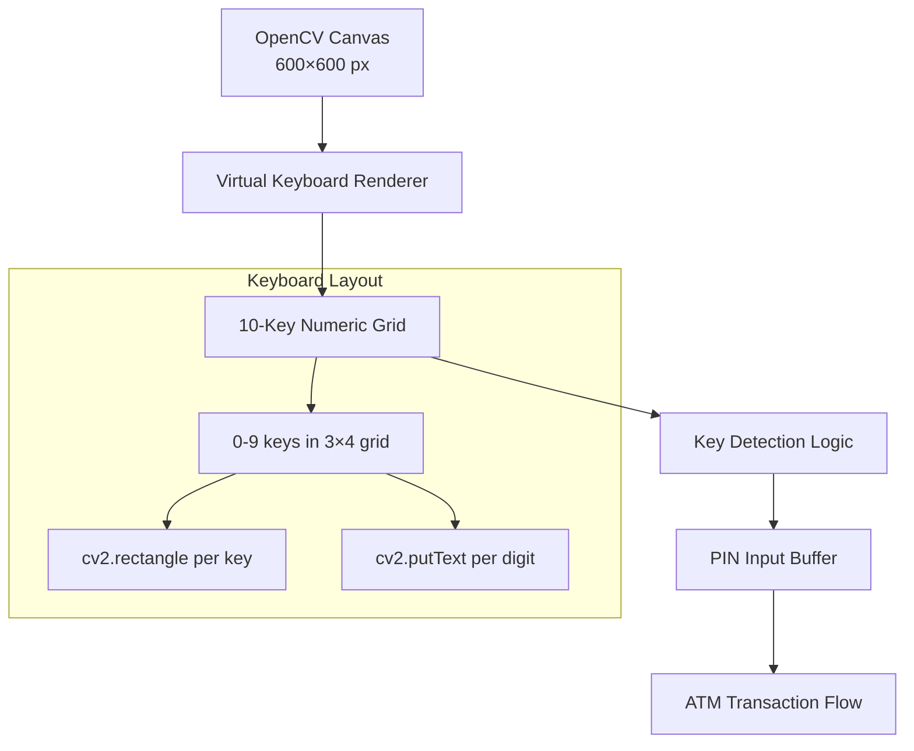

<div align="center">

# The Bank — Contactless ATM Interface


*Contactless ATM machine software — a virtual on-screen keyboard rendered with OpenCV for touchless PIN entry, designed for public safety.*

</div>

---

## Overview

A computer vision-based virtual keyboard that renders a numeric keypad using OpenCV. Designed as the input interface for a contactless ATM system — users interact with the on-screen keys without physically touching a surface, reducing germ transmission in public ATM machines.

## Architecture



## How It Works

1. Creates a blank 600×600 NumPy canvas
2. Renders a 3-column numeric keypad using `cv2.rectangle` and `cv2.putText`
3. Each key is positioned on a 200×200 grid with proper text centering
4. Displays the keyboard via `cv2.imshow` for user interaction

## Getting Started

```bash
pip install opencv-python numpy
jupyter notebook "Keyboard OpenCV.ipynb"
```

## Built With

- Python 3 — Core language
- OpenCV — Keyboard rendering and display
- NumPy — Canvas array manipulation

---

<div align="center">

Built by [Akhila Susarla](https://github.com/Akhila-Susarla)

</div>
